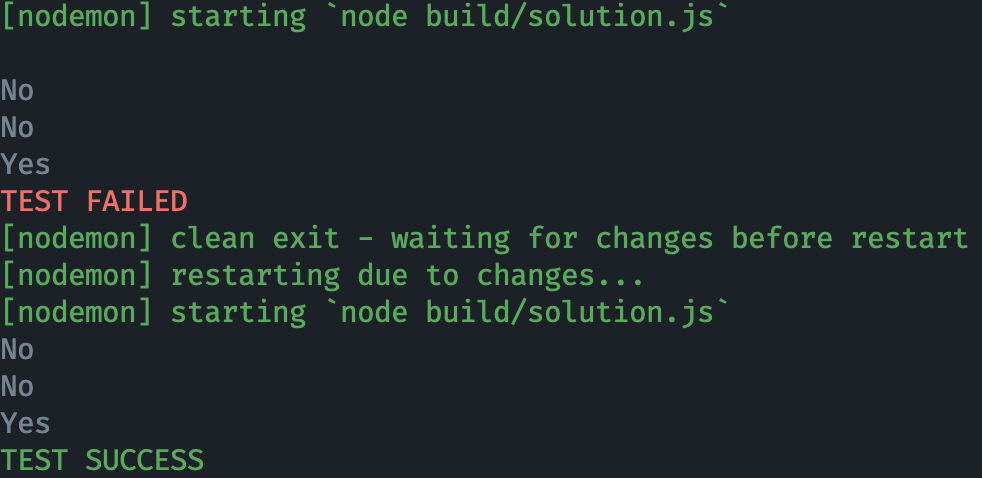

# Baekjoon Typescript Template

`Baekjoon Online Judge`는 Typescript를 지원하지 않습니다.  
Typescript로 문제를 풀고, Javascript로 변환해서 제출해야 합니다.  

또, 값 입력 받는 로직이 매번 작성하기에는 굉장히 번거롭습니다.

그래서 제가 이번에 이러한 문제점들을 해결해주는 Template을 작성했습니다.

## Badges

<!-- Badges -->
[](https://github.com/rhea-so/BaekjoonTypescriptTemplate/issues)
[](https://github.com/rhea-so/BaekjoonTypescriptTemplate/pulls)
[](https://github.com/rhea-so/BaekjoonTypescriptTemplate)

## How to use

### ① [Baekjoon Online Judge](https://www.acmicpc.net/problemset)에서 풀고 싶은 문제를 찾습니다.

### ② Project Cloning

```sh
git clone https://github.com/rhea-so/BaekjoonTypescriptTemplate # or Your Forked Repository URL
cd BaekjoonTypescriptTemplate
npm i
```

### ③ Input과 Output을 정의

`data/input.txt`

```txt
예제 입력
```

`data/output.txt`

```txt
예제 출력
```

### ④ Code 작성

```typescript
/// <reference path="../lib/index.ts" />   <- 제가 작성한 라이브러리를 불러오는 코드입니다. IO 기능을 사용할 수 있습니다.

/**
 * 터미널 입력 값 대신 data/input.txt, data/output.txt을 사용하도록 설정합니다.  
 * Baekjoon Online Judge에 업로드 할 용도로 빌드하는 경우에는, 아래 코드를 주석 처리 해주셔야 합니다.
 * 
 * 터미널을 끝내려면 Ctrl + D를 눌러주세요.
 */
IO.setDebugMode();

IO.readNumber(); // 정수 하나를 입력 받습니다.
IO.readString(); // 문자열 하나를 입력 받습니다. (공백 문자에 의해 분리됨)
IO.write("String"); // 문자열을 출력합니다.
IO.writeln("String"); // 문자열을 출력합니다. 맨 마지막에 개행 문자가 항상 붙습니다.
```

#### 예시

```typescript
/// <reference path="../lib/index.ts" />

IO.setDebugMode();

const firstValue = IO.readNumber();
const secondValue = IO.readNumber();

IO.write(`${firstValue + secondValue}`);
```

### ⑤ Build & Run

```sh
npm start
```

#### IO.setDebugMode();를 실행시, 아래 사진처럼 자동으로 테스트까지 해줍니다.



### ⑥ Baekjoon Online Judge에 소스코드 업로드 

`build/solution.js`의 소스코드를 그대로 업로드 하시면 됩니다.

### ⑦ TIP

* 터미널 두 개를 띄우셔서 한 쪽에는 `tsc -w`, 다른 한 쪽에는 `nodemon build/solution.js`를 실행시키시면  
  소스코드가 수정될때마다 자동으로 테스트를 돌려줘 굉장히 편합니다.
* 문제를 풀었으면 `solve` 폴더에 백업을 해보세요.

## Documentation

* [프로젝트 변경 사항](https://github.com/rhea-so/BaekjoonTypescriptTemplate/blob/main/CHANGELOG.md)
* [프로젝트 발전 방향](https://github.com/rhea-so/BaekjoonTypescriptTemplate/blob/main/ROADMAP.md)

## Contribute

부탁드립니다. 이 프로젝트는 여러분의 기여를 바라고 있습니다. 기여를 해주세요.  
기여를 하는 법은 크게 어렵지 않습니다!!

* [당장 기여하는 방법 알아보기](https://github.com/rhea-so/BaekjoonTypescriptTemplate/blob/main/CONTRIBUTING.md)
* [기여 해주신 고마운 분들](https://github.com/rhea-so/BaekjoonTypescriptTemplate/blob/main/CONTRIBUTORS.md)

## Questions

* GitHub - [open issue](https://github.com/rhea-so/BaekjoonTypescriptTemplate/issues)
* Email - [jeonghyeon.rhea@gmail.com](mailto:jeonghyeon.rhea@gmail.com?subject=[GitHub]%20Project%20Moon%20Community-Question)

### License

[GPL-3.0 License](https://github.com/rhea-so/BaekjoonTypescriptTemplate/blob/main/LICENSE)
